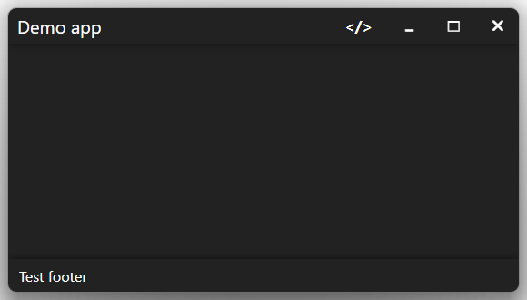

This is a .NET 8 template for a desktop Blazor app with a custom title bar.\
Implemented with WinForms, using the `BlazorWebView` component.

# Goals
- Recreate the title bar as a Blazor component – to simplify customization and integration with the rest of a Blazor desktop app.
- Make the app window behave as similarly as possible to a native Windows window.

Many window features work out of the box in a WinForms form. However, some features had to be reimplemented to make them usable in Blazor.

# Usage
For a Visual Studio environment, make sure you have the following workloads installed (via Visual Studio Installer):
- ASP.NET and web development
- .NET desktop development

Then download the source code of this and open the `.sln` file in Visual Studio.

The `BlazorWinFormsCustomTitleBar` project contains a custom WinForms form with a Blazor component, as well as the necessary functions and properties to implement a custom title bar.\
This is only a class library, not a runnable project.

The `BlazorWinFormsCustomTitleBarDemo` project is an example implementation you can use as a start point.

# Main features
*at least some of these features were missing from other solutions I've found*
- resize the window by dragging its borders
  - you can implement top border resizing with `TopBorderLeftButtonDown(doubleClick:false)` and css `cursor: n-resize`; other borders and all corners work automatically
- resize the window to the full height by double-clicking the top border
  - you can implement this with `TopBorderLeftButtonDown(doubleClick:true)`
- no window resizing limits\
  some solutions I've found required limiting the window size to the size of one of the screens
- the original Windows borders\
  in Windows 11, this means rounded corners and a shadow 
- no white bar on the top border
- drag the window by dragging the title bar\
  this also allows you to use snap layouts in Windows 11
  - you can implement this with `TitleBarLeftButtonDown(doubleClick:false)`
- maximize/restore the window by double-clicking the title bar
  - you can implement this with `TitleBarLeftButtonDown(doubleClick:true)`
- show the system menu by right-clicking the title bar
  - you can implement this with `TitleBarRightButtonUp()`
- minimize, restore/maximize, and close the window using buttons
  - you can implement these with `Minimize()`, `ToggleMaximization()`, and `Close()`
- a maximized window does not cover the taskbar
- the title bar changes appearance when the window is out of focus
  - you can implement this using the `IsActive` property and the `ActiveChanged` event
- working Windows shortcuts, such as `Alt`+`F4` and `Alt`+`Space`
- seems to work fine in a multi-screen setup

The above mentioned functions, properties, and events are part of the `TitleBarLessBlazorWindow` class. Use them in your custom Blazor title bar.

# Additional features
- in Blazor services, the form window instance is a singleton by default
- you can include your own service declarations with the `AddBlazorServices` property
- by default, the `WebView` right-click context menu doesn't contain browser-related items such as *Back*, *Refresh*, or *Share*
  - you can override this implementation with the `WebViewContextMenuRequested` property
- by default, browser-related keyboard shortcuts, autofill in input fields, and zoom controls are disabled
  - you can change these settings, as well as others, with the `InitializeWebViewSettings` property
- light/dark system theme preference detection
  - exposed as the `SystemPreferredTheme` property and the `SystemPreferredThemeChanged` event

# Known missing features
- hovering over the maximize/restore button doesn't show the snap layouts menu\
  There's an [article about this](https://learn.microsoft.com/en-us/windows/apps/desktop/modernize/ui/apply-snap-layout-menu), but the implementation is not straightforward in this case.

# Potential issues
- the original Windows title bar is actually hidden outside the window. I haven't encountered any problems with this solution yet, but I'm afraid they might appear at some point.

# Other notes
- I've tested the solution on Windows 11. I don't know if it works as intended on other systems.
- I'd be happy to see your suggestions and solutions for the missing features and issues.
